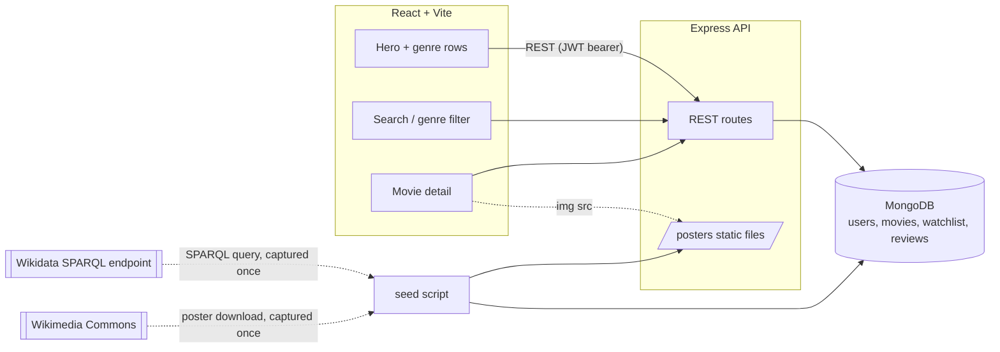

# Architecture

## Why movies are imported once, not queried live

Same reasoning as openshelf's Open Library import: Wikidata's public SPARQL endpoint
(`query.wikidata.org`) is shared infrastructure with no documented per-app SLA, and this app's
search/browse/genre-row/recommendation queries all need to run fast and often. `npm run seed` runs
8 genre-scoped SPARQL queries once, captured as committed fixture files
(`server/src/seed/fixtures/wikidata_*.json`), and every runtime query hits MongoDB only.

## Posters are downloaded once, not hotlinked

This one wasn't a design choice made in advance — it was found by actually loading the app.
Wikidata's `image` property (P18) points at `commons.wikimedia.org/wiki/Special:FilePath/...`, and
the first version of this app rendered that URL directly in every ``. Loading the home
page — one hero image plus 8 genre rows of ~12 posters each, fired concurrently by the browser —
tripped Commons' rate limiter within seconds; `curl` against the same URLs during debugging
reproduced a bare `429 Too Many Requests`, confirming it wasn't a one-off. See
[`DECISIONS.md`](./DECISIONS.md) for the fix (download once at seed time, serve from local disk).

## Request flow

1. Auth is the same JWT-access-in-memory / refresh-in-`httpOnly`-cookie pattern as pulseboard and
   openshelf — see either of those repos' `docs/DECISIONS.md` for the reasoning.
2. `GET /api/movies/home` returns a hero list (5 most recent movies with a poster) and one row per
   genre (`genreRows()` in `movieService.js`) — the data for the entire Netflix-style landing page
   in one request.
3. `GET /api/movies` is the cursor-paginated search/browse endpoint — `$text` search plus a
   `genre` facet filter, same cursor-pagination shape as openshelf's book search.
4. `GET /api/movies/:id` fans out three queries in parallel: reviews, "similar movies" (a genre-
   overlap aggregation pipeline — `$setIntersection` between this movie's genres and every other
   movie's, ranked by overlap size), and whether the current user has this movie on their watchlist.
5. Poster images are served from `server/public/posters/` via `express.static`, mounted at
   `/posters` — plain files on disk, gitignored (binary, regenerated by seed), same pattern as
   openshelf's `multer` avatar uploads.
